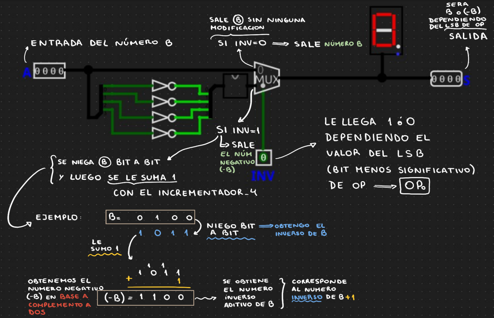

Circuito *inversor_4*  ->  calcula -B a partir de B

¿Que operaciones hace ese circuito sobre el numero B?

Dependiendo del bit menos significativo(LSB) de OP hay que hacer A+B o A-B.

En caso de que el LSB = 0 -> *se devuelve el numero B*

En caso de que el LSB = 1 -> *se devuelve el numero (-B)* (explicacion de como lo hace en la imagen)
En vez de hacer A-B se hace A+(-B), es decir se le suma el complemento a dos del numero B.Entonces utilizamos el complemento a dos para realizar la operacion de resta. 

