Taller de git
=============

En este taller vamos a explorar el uso de la herramienta **git**. Cabe aclarar que **git** es una
herramienta muy versátil y poderosa, que se puede adaptar a una cantidad de escenarios y flujos de trabajo.
Por esta razón, en una primera mirada nos puede parecer abrumador el número de comandos y variantes que nos brinda, 
pero trataremos de restringirnos a los usos más comunes y al *workflow* que usaremos en la materia.

Debido a su popularidad, se dispone de una cantidad enorme de tutoriales y guías de uso. Recomendamos sólo algunas que nos parecieron interesantes en la sección [Referencias](#ref).

Supondremos a lo largo del taller, una instalación de Linux, de tipo Ubuntu/Debian. Si instalaste alguna distribución basado en otro sistema (Arch, Fedora), entonces entendemos que *sabes de qué va la cosa*

El listado de temas que vamos a explorar abarca los siguientes:

 - [Instalación y configuración](#installation)
 - [Clonando el repo](#cloning)  
    - [Branches](#branches)
    - [Branch protegidos](#protected)
    - [Creación de un branch de trabajo](#workbranch)
 - [División de Trabajo](#div-trabajo)
    - [Merging](#merging)
    - [Interacción con remoto](#remoto)
 - [Pull request](#PR)
 - [Referencias](#ref)

<h2 id="installation">Instalación y configuración</h2>

Para instalar **git** en una distribución Debian/Ubuntu simplemente debemos hacer:

```shell
$ sudo apt install git
```

Podemos comprobar que ha sido instalado correctamente, haciendo

```shell
$ git --version
```

En cuanto a la configuración, debemos indicarle a git nuestro nombre y mail para que pueda firmar los commits
cada vez que hagamos uno.

```shell
$ git config --global user.name <su nombre>
$ git config --global user.email <su email>
```

Pasando el parámetro `--global` aplicamos la configuración para nuestro usuario, con lo cual quedará configurado con estos parámetros para todos los repos nuevos que creemos.

<h2 id="cloning">Clonando el repo</h2>

Antes de empezar, si todavía no lo hiciste, es necesario que clones el repositorio actual a tu PC. De esta manera, podremos trabajar localmente sobre el repositorio e ir enviando los cambios al remoto (en este caso alojado en **github.com**), a medida que lo creamos necesario.

Hay 3 formas de hacerlo:
+ Utilizando la url que comienza con *https://github.com*
+ Por SSH
+ Por Github CLI

Ahora si clonamos por la primera opción, cada vez que hagamos alguna operación con el servidor remoto desde nuestra PC, github nos pedirá las credenciales de autenticación. Esto se torna molesto rápidamente. Se puede solucionar configurando un administrador de credenciales que utilice un caché para no tipear nuestro password cada vez, pero creemos que lo más sencillo es configurar un acceso por *ssh*. Para configurar una clave ssh, seguí los pasos que están en el siguiente [link](https://docs.github.com/es/authentication/connecting-to-github-with-ssh). Los pasos claves son "Generación de una nueva clave SSH y adición al agente SSH" y "Agregar una clave SSH nueva a tu cuenta de GitHub".

Una vez configurada nuestra clave ssh (se puede [probar](https://docs.github.com/es/authentication/connecting-to-github-with-ssh/testing-your-ssh-connection)!), cuando querramos clonar el repo, vamos a usar la dirección que comienza con **git@github.com**

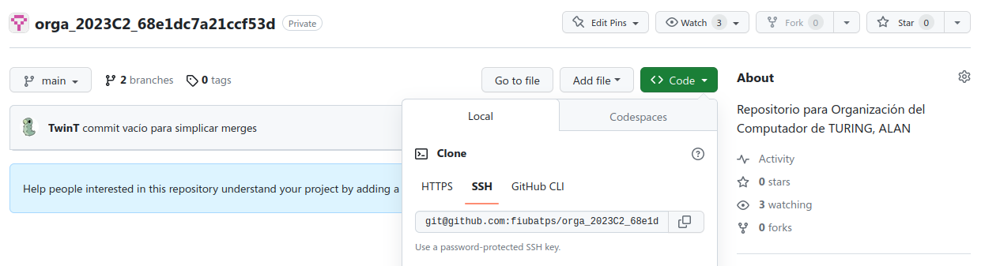

Por ejemplo para clonar el repo con url: **git@github.com:fiubatps/orga_2023C2_68e1dc7a21ccf53d.git** (van a tener un url con un hash distinto), nos posicionamos en un lugar en el cual querramos crear el repositorio en nuestro filesystem e ingresamos en la terminal 

```shell
$ git clone git@github.com:fiubatps/orga_2023C2_68e1dc7a21ccf53d.git
```

Si todo salió bien, deberíamos ver algo parecido a lo siguiente:

```shell
Cloning into 'orga_2023C2_68e1dc7a21ccf53d'...
remote: Enumerating objects: 24, done.
remote: Counting objects: 100% (24/24), done.
remote: Compressing objects: 100% (19/19), done.
remote: Total 24 (delta 0), reused 24 (delta 0), pack-reused 0
Receiving objects: 100% (24/24), 303.16 KiB | 192.00 KiB/s, done.
```

y tendremos un directorio **orga_2023C2_68e1dc7a21ccf53d**. Si entramos haciendo:

```shell
$ cd orga_2023C2_68e1dc7a21ccf53d
$ ls
```

Vemos que el directorio... ¡Está vacío! ¿Dónde están los archivos? 😕
La lógica detrás de esto se esconde en el esquema de branches que usaremos en la materia.

<h3 id="branches">Branches</h3>

Las branches nos permitiran divergir de la linea principal de código para continuar nuestro trabajo sin afectar el código principal, esto generalmente se conoce como ***branching*** o ***ramificaciones***.

  

Para entender cuales son las branches locales que tenemos en el repositorio podemos hacer:

```shell
$ git branch
```

En nuestro repo tenemos un repositorio con 1 rama:
+ main

  
por lo que nos tiene que aparecer de la siguiente manera:

```shell
* main
```
pero ¿Qué significa el "*" ?

El asterisco (*) indica la rama actual en la que te encuentras trabajando. En el caso del ejemplo, nos ubicamos en la rama "main". 

Ahora, si hacemos:

```shell
$ git branch -vv -a
```
+ -vv: Activa el modo "very verbose", lo que agrega información adicional a la salida del comando.
+ -a: Incluye tanto las ramas locales como las remotas en la lista.

Por lo tanto, ejecutando este comando se nos va a mostrar algo como lo siguiente:

```shell
* main                             e0c8437 [origin/main] commit vacio para simplificar merges
  remotes/origin/gitlab 68ad74a Se publica el tp gitlab
  remotes/origin/HEAD   -> origin/main
  remotes/origin/main   e0c8437 commit vacio para simplificar merges
```

Aquí vemos que nuestro branch actual (¡donde está el "*"!) **main**, tiene un commit y además está siguiendo a **origin/main**. 

¿Qué es **origin**?

Básicamente es el nombre por default que git le asigna al remoto desde el cual hicimos el **git clone**. Es decir, en este caso,
**origin** hace referencia a la copia del repositorio que está alojada en github.com.

Todos los branches que aparecen listados que empiezan con *origin/<nombre>, son básicamente los nombres de los branches que están en el remoto. El único branch del remoto que no tenemos es **gitlab** (un momento... ¿y *origin/HEAD* qué es? Es básicamente un marcador que apunta al branch por default del remoto. Este branch, por ejemplo, es el que se replica localmente al hacer un **git clone**)

Ahora, si queremos cambiar nuestro espacio de trabajo a otra rama se debe ejecutar el comando *git checkout nombreRama*.
Por ejemplo, si nos queremos mover a la rama gitlab debemos ejecutar:

```shell
$ git checkout gitlab
```

Con esto ahora tendríamos que poder ver el branch **gitlab**:

```shell
* gitlab
  main
```

*CUIDADO* :
+ Si existe el branch local, hace el switch de branch y ya
+ Si no existe, se fija si existe un branch remoto (origin/<branch>) con el mismo nombre y, de ser así, crea un branch local con ese nombre y lo setea como tracking branch del remoto.

Todo esto que hicimos podemos también verlo en el editor [vscode](https://code.visualstudio.com/)

Dos extensiones que recomendamos que tengan instaladas son: 

[gitlens](https://marketplace.visualstudio.com/items?itemName=eamodio.gitlens)
[git-graph](https://marketplace.visualstudio.com/items?itemName=mhutchie.git-graph)

Pueden instalarlas de dos maneras:
1. Desde el marketplace 
2. Haciendo Ctrl + P (Quick Open) y luego:

```shell
ext install mhutchie.git-graph
ext install eamodio.gitlens
```

Para acceder al gráfico de git:

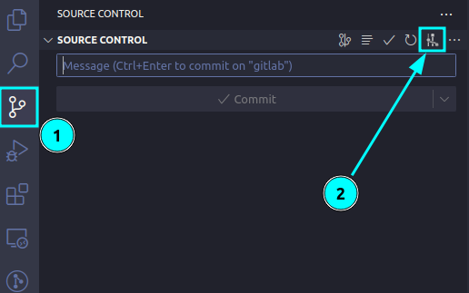

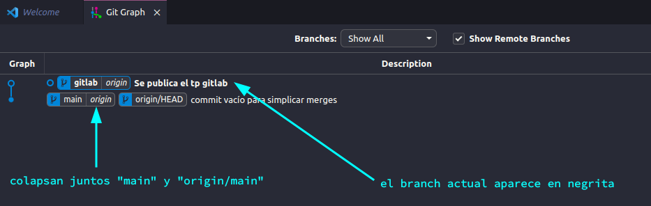


<h3 id="protected">Branches protegidos</h3>

Ahora, antes de empezar a generar cambios en el repositorio, necesitamos entender un concepto más: **branch protegidos**. Este tipo de branches, limita la cantidad de operaciones que una persona *con acceso* al repositorio puede realizar sobre dicho branch. ¿Cuál es la idea? El *owner* o administrador del repositorio quiere que, al integrarse cambios de otros usuarios a dicho branch, no sean integrados a través de un *commit* y *push* regular, sino que pasen por algún proceso de validación 👮‍♂️

Cuando marcamos un branch como protegido, estamos estableciendo algunas reglas que todos deben seguir (incluso se pueden aplicar a los mismos admins) antes de que los cambios en ese branch sean aceptados. Por ejemplo, una regla común es que se requieran revisiones de código antes de fusionar cualquier cambio en ese branch. Esto significa que la personas designadas (*maintainers* o *admins* por ejemplo) tienen que revisar los cambios y darles el visto bueno antes de que se mezclen en el branch protegido.

Además de las revisiones de código, también se puede configurar otras reglas, como la obligación de que las pruebas automatizadas pasen antes de que se puedan fusionar cambios, o incluso restringir quiénes pueden aprobar y fusionar cambios en el branch. Esto es especialmente útil en proyectos colaborativos para mantener el control sobre lo que se agrega al código base.

El mecanismo subyacente es propio de github y se llama **Pull Request (PR)**. *Gitlab.com* también dispone de un mecanismo básicamente idéntico llamado de forma más propiada *merge request*. 
Este mecanismo de PR es muy importante, y requiere cierta elaboración para explicarlo en detalle. Lo veremos más adelante. Por ahora tratemos de entender cómo podemos empezar a desarrollar nuestro trabajo y luego intentaremos integrar los cambios.


<h3 id="workbranch">Creación de un branch de trabajo</h3>

Vamos a crear un branch de trabajo a partir del branch protegido **gitlab**. Lo llamaremos, **gitlab-dev**. 

**IMPORTANTE**: Debemos estar parados sobre el branch **gitlab**, para que nuestro branch tenga una historia común cuando lo querramos mergear más adelante. De esta manera, todo lo que estaba hasta el momento en la rama **gitlab** se va a copiar en la nueva rama **gitlab-dev**.

Chequeamos con ```git branch``` que estamos en **gitlab** y luego hacemos

```shell
$ git checkout -b gitlab-dev 
```
+ Crea una nueva rama: La opción -b le indica a Git que deseas crear una nueva rama. Después de -b, proporcionas el nombre de la nueva rama que deseas crear. En este caso, estamos creando una nueva rama llamada "gitlab-dev".
+ Cambiar a la nueva rama: Después de crear la nueva rama "gitlab-dev", indicandole con **git checkout**, Git automáticamente cambia a esa rama para que puedas empezar a trabajar en ella. En otras palabras, después de ejecutar el comando, estarás en la rama "gitlab-dev".

Podemos hacer lo mismo desde **vscode** de la siguiente manera: 

Botón secundario en el área vacía, siendo el branch actual **gitlab**.

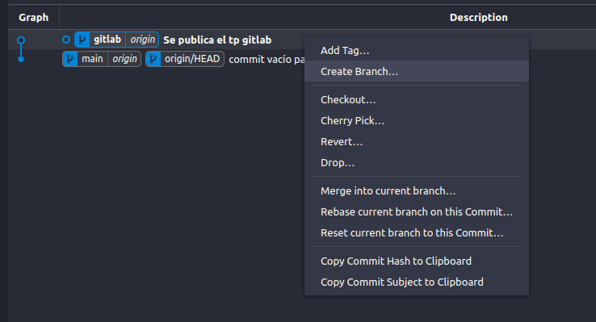

Ponemos el nombre y hacemos también un checkout al nuevo branch.

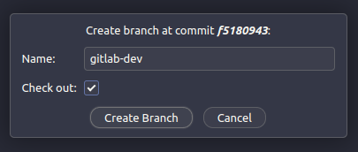

<h2 id="div-trabajo">División de trabajo</h2>

Estando en nuestro nuevo branch **gitlab-dev**, miremos de qué se trata el código, entrando en `gitlab/code`.
Antes de comenzar, miremos el archivo `README.md` dentro del directorio `code` e instalemos los prerequisitos para que podamos correr los tests.

Luego, si observamos el archivo *lib.h*, vemos que tenemos que definir en C una función que remueva duplicados, llamada `distinct`:

```c
// Definir una función que remueva duplicados del array de enteros no negativos y devuelva el resultado
// El orden de la secuencia debe mantenerse igual


// Ejemplos:

// Input -> Output
// [1, 1, 2] -> [1, 2]
// [1, 2, 1, 1, 3, 2] -> [1, 2, 3]

int *distinct(const int *values, size_t count, size_t *pResultCount);
// Guardar la cantidad de valores distintos en la memoria apuntada por
// pResultCount. Si values == NULL o count == 0, entonces *pResultCount == 0.
```

Si ejecutamos 

```shell
$ make tester
$ ./tester
```

Claramente, vemos que los tests fallan debido a que todavía no definimos la función `distinct`.

Supongamos ahora, el siguiente escenario: nos ponemos de acuerdo con nuestro compañero de grupo llamado Mordin, en dividir el problema y que cada uno trabaje en su propio branch. Nosotros crearemos una función **contains** que nos dice si un elemento pertenece o no al array y Mordin creará la función **distinct** que es la pedida, utilizando nuestra función **contains**. Ambos trabajarán sobre el mismo archivo en diferentes funciones.

Entonces, hacer lo siguiente:

+ Crear un branch **gitlab-mordin** (saliente también de **gitlab**) 
+ Agregar el siguiente código en el archivo **lib.c**:

```c
int *distinct(const int *values, size_t count, size_t *pResultCount) {
    if (values == NULL || count == 0) {
        *pResultCount = 0;
        return NULL;
    }

    int *result = (int *)malloc(count * sizeof(int));

    size_t resultCount = 0;

    for (size_t i = 0; i < count; i++) {
        if (!contains(result, resultCount, values[i])) {
            result[resultCount] = values[i];
            resultCount++;
        }
    }

    *pResultCount = resultCount;
    return result;
}
```

+ Guardar las modificaciones presionando sobre el archivo **lib.c** Ctrl+S (no olvidarse!!)
+ Hacer commit. Una forma de hacerlo sobre VSC es:
 
  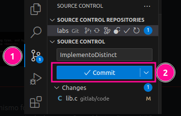


- Volver al branch **gitlab-dev** (con **checkout**!!) y hacer un commit agregando el siguiente código en **lib.c**:

```c
int contains(const int *array, size_t size, int value) {
    for (size_t i = 0; i < size; i++) {
        if (array[i] == value) {
            return 1; // Valor encontrado en el array
        }
    }
    return 0; // Valor no encontrado en el array
}
```

El panorama nos tendría que quedar así, masomenos:

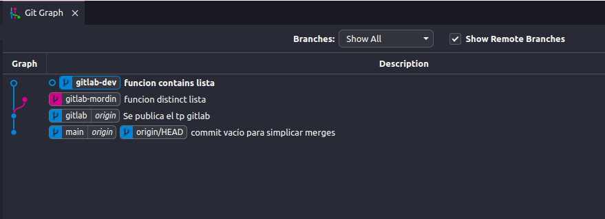

Ok! Estamos listos para hacer un merge y poder probar la solución completa. El merge lo podríamos hacer hacia cualquier branch (**gitlab-dev** o **gitlab-mordin**), pero lo más adecuado es tener uno de los dos como "referencia". Definimos que nuestro branch de referencia es **gitlab-dev**, traigamos el contenido de **gitlab-mordin** HACIA **gitlab-dev**.

<h3 id="merging">Merging</h3>

Para hacer el merge debemos recordar algo importante:

>El merge se hace HACIA el branch actual

Entonces, en este caso, nos tenemos que parar en **gitlab-dev** y con vscode podemos hacer el merge de la siguiente manera:

Tocamos botón secundario sobre el **branch** que nos queremos traer y elegimos: *merge into current branch*

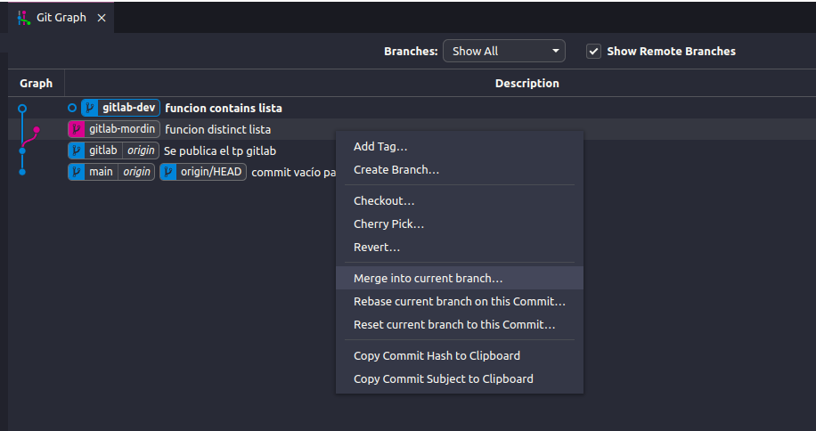

Si no hubo conflictos, nos tendría que quedar algo así:

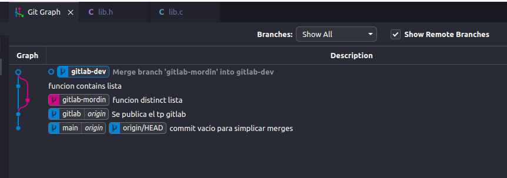

Esto también se puede realizar mediante comandos de la siguiente forma

> Recalcamos la importancia de estar situados en la branch **gitlab-dev**
```
git checkout gitlab-dev
git merge gitlab-mordin 
```

Y obtendremos el mismo resultado

Ahora podemos correr los tests, y ver si funciona:

```shell
$ make tester
$ ./tester
```

<h3 id="remoto">Interacción con remoto</h3>

Hasta ahora hemos estado trabajando localmente, y todos nuestros cambios han modificado el estado del repositorio local (recordar que se encuentra alojado en el directorio oculto **.git**)

Si quisiéramos enviar los cambios al servidor remoto, tenemos que usar el comando **push**. Veamos qué pasa si lo corremos desde terminal directamente, estando parados en el branch **gitlab-dev**

```shell
$ git push
fatal: The current branch gitlab-dev has no upstream branch.
To push the current branch and set the remote as upstream, use

    git push --set-upstream origin gitlab-dev
```

Oops! Parece que algo anda mal. El problema es que no existe una contraparte remota de nuestro branch local en *origin*. En otras palabras, la branch **gitlab-dev** solo existe en nuestro repositorio local y NO en el remoto. Para esto, git nos sugiere un comando, que además de pushear nuestros cambios, **crea el branch en origin** y lo setea como nuestro *upstream* branch para **gitlab-dev**.

Esto se manifiesta de manera equivalente en vscode, cuando aparece el mensaje *publish branch* 

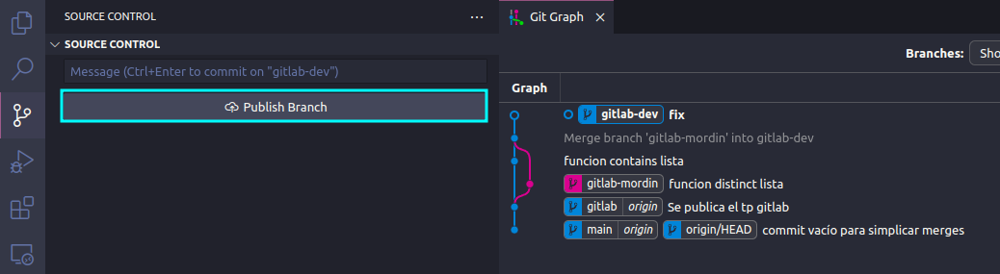

que por debajo, corre el mismo comando.


Ejecutemos entonces el comando en cuestión y publiquemos nuestro branch. Lo haremos por línea de comando esta vez simplemente para obtener un poco más de información:

```shell
git push --set-upstream origin gitlab-dev                                                                                                                          ─╯
Enumerating objects: 24, done.
Counting objects: 100% (24/24), done.
Delta compression using up to 8 threads
Compressing objects: 100% (20/20), done.
Writing objects: 100% (20/20), 2.11 KiB | 540.00 KiB/s, done.
Total 20 (delta 8), reused 0 (delta 0), pack-reused 0
remote: Resolving deltas: 100% (8/8), completed with 1 local object.
remote: 
remote: Create a pull request for 'gitlab-dev' on GitHub by visiting:
remote:      https://github.com/fiubatps/orga_2023C2_c454a9a14a60b99f/pull/new/gitlab-dev
remote: 
To github.com:fiubatps/orga_2023C2_c454a9a14a60b99f.git
 * [new branch]      gitlab-dev -> gitlab-dev
Branch 'gitlab-dev' set up to track remote branch 'gitlab-dev' from 'origin'.
```

Después de una enumeración de estadísticas sobre el contenido que subimos, vemos algunas cosas interesantes:
- `Create a pull request for 'gitlab-dev' on GitHub by visiting`, es un mensaje que nos da github, sugiriendo que podemos armar un Pull Request para integrar nuestro trabajo a algún otro branch. Lo vemos en la siguiente sección
-  `Branch 'gitlab-dev' set up to track remote branch 'gitlab-dev' from 'origin'.` De ahora en más, haciendo sólo `git push` en este branch estaremos actualizando el branch remoto homólogo.


Para incorporar cambios del repositorio remoto a nuestro repositorio local, empleamos el comando git pull. En términos sencillos, cuando nuestro colega Mordin efectúe actualizaciones en el repositorio remoto mediante sus modificaciones (tras haber realizado un commit->push), nuestro paso siguiente sería sincronizar nuestro repositorio local para reflejar estos cambios ya registrados en el repositorio remoto.
Para entender mejor como funciona esta mecanismo, observemos el siguiente gráfico:

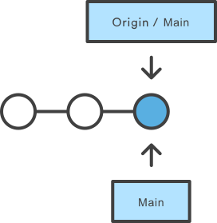

Podemos ver que tanto **main** como **origin/main** se encuentran sincronizados, ya que están apuntando al mismo commit. 

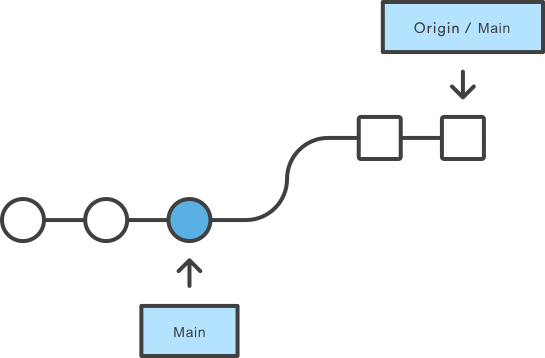

Ahora, si el remoto sufrió cambios y queremos simplemente saber si hay cambios (no integrarlos localmente todavía), hacemos un *fetch*:

```shell
$ git fetch
```

El comando fetch es *inofensivo*, ya que sólo actualiza el estado de nuestro tracking branch **origin/main**. Cuidado con este concepto, porque técnicamente no es lo mismo, branch remoto que mi branch local que *trackea* al branch remoto.

> Así que **origin/main** es un *remote tracking branch* para **main** en el repo origin

Por eso el fetch es inofensivo, ya que no toca nuestro branch local **main**. Si quisiéramos actualizar, ahora sí, nuestro branch **main**, estando parados en el mismo, podemos hacer:

```shell
$ git merge origin/main
```

que lo que hace es integrar los cambios hacia el branch **main**. Lo que hace un `git pull`, es simplemente una combinación de estos dos últimos comandos: `git fetch` y `git merge origin/main`. En la siguiente figura, se muestra el resultado luego del merge.

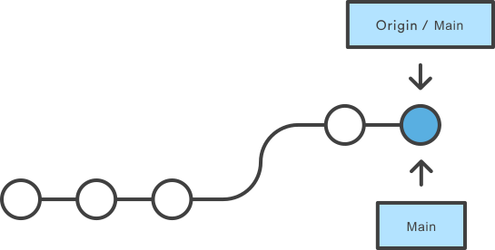


Este escenario es el más conveniente ya que el merge es trivial, ya que no tenemos commits locales ausentes en nuestro repo remoto. Distinta es la situación en este caso:

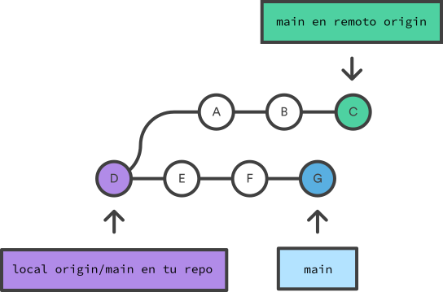


En este caso, al hacer el merge, puede haber conflictos o puede no haberlos, dependiendo de los cambios introducidos. 

Algo importante a tener en cuenta es que

> Conviene hacer un pull antes de empezar a trabajar, para entonces estar trabajando sobre la versión más actual

Esto nos evitará resolver conflictos de integración a posteriori. No quiere decir que no los haya: bien puede alguien pushear algo *mientras* estamos trabajando. Por eso es conveniente tener alguna estrategia de división de trabajo, como vimos anteriormente y para tratar de no colisionar con los cambios introducidos.

<h2 id="PR">Pull Request</h2>

En esta instancia, con los tests funcionando localmente y nuestros cambios pusheados a **gitlab-dev**, ya estamos preparados para iniciar un Pull Request (PR), con el cual realizaremos la entrega del taller.

¿En qué consiste?

- Iniciaremos el PR en la web, desde el branch **gitlab-dev** hacia el branch **gitlab**
- Esto dispará los tests automáticos, que en este caso consisten básicamente en ejecutar los tests que corrimos localmente en un ambiente controlado y aislado. 
- Podemos luego ver el resultado de los tests y vanagloriarnos de nuestro éxito si todo está bien o comenzar lentamente a cuestionarnos nuestra misma existencia en el cosmos si hubo alguna falla.

Veamos cómo sehace el proceso, paso a paso:


Lo primero que hacemos es ir a nuestro repo en la web de github y hacemos click en la solapa "Pull Requests" y luego en el botón "Compare & pull request" (este botón aparece, ya que github detecta un push reciente y nos sugiere hacer un PR). Si no aparece este botón, simplemente hacemos click en el botón inferior que dice "New Pull Request"

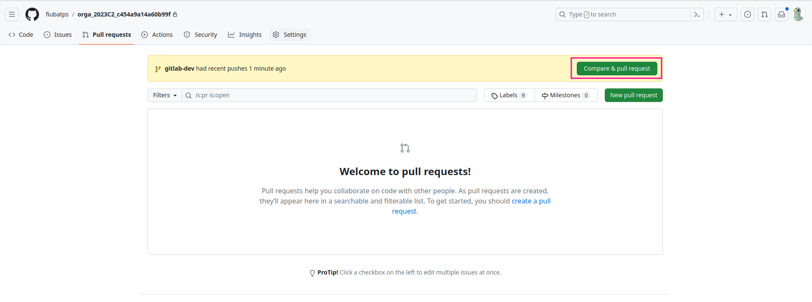

Una vez en la siguiente ventana, tenemos que definir

1. Desde que branch hacia qué branch hacemos el PR. En nuestro caso, desde el branch **gitlab-dev** hacia el branch **gitlab**
2. Podemos poner un nombre al PR, como "Entrega taller gitlab" o lo que ustedes quieran. Este nombre identifica a todo el PR
3. Finalmente, tocamos "Create Pull Request"

Optativamente, pueden agregar una descripción sobre los cambios que incorpora nuestro PR. No es nuestro caso para la entrega de talleres.

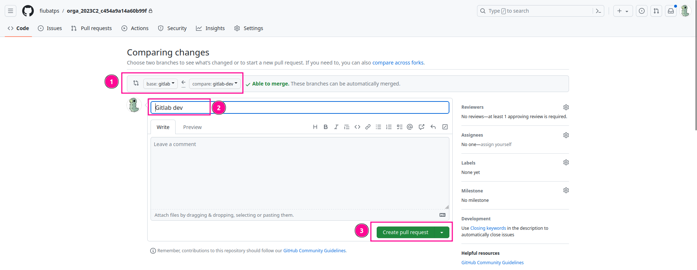

Una vez que crean el PR, si hay algún test automático, se va a disparar y pueden ver su progreso. Notar cómo, además, no es posible mergear en este caso, salvo explícita aprobación de un reviewer. En el caso de los talleres, no estaremos haciendo efetivos los merges, sólo usamos los PR como mecanismo de entrega y de verificación.

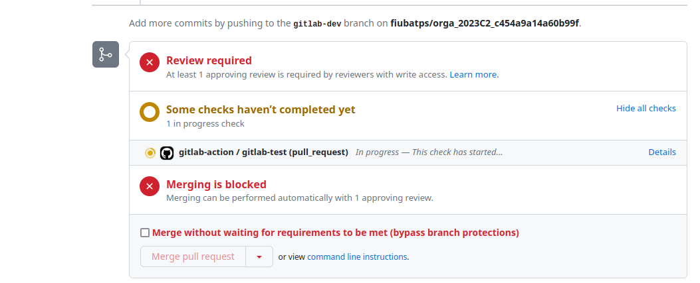

Si todo va bien, luego de algunos momentos, el test pasa. Pueden ver los detalles haciendo click en "Show all checks" y en "details"

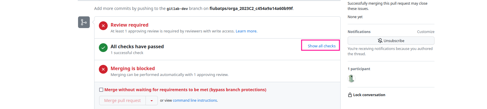

El test involucra varios pasos, desde la creación del ambiente, disparo de actions, configuración del Docker container y checkout del repo, hasta la ejecución propiamente dicha del test. Pueden mirar las diferentes etapas para satisfacer su curiosidad, y en especial la etapa de "test", que es la más parecida a la que corren en sus repos locales, con lo cual deberían mirarla en caso de que el test no pase.

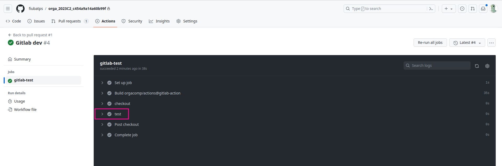

¡Con esto quedaría completa la entrega! 

Con este manejo y un poco de práctica que irán obteniendo durante la cursada, será suficiente para que puedan hacer un uso inteligente de git en la materia y coordinen el trabajo en grupo de manera efectiva.

Les dejamos algunas referencias de material complementario para que puedan profundizar si así lo desean

<h2 id="ref">Referencias</h3>

 - [Nuestra guía](https://orgacomp.github.io/9557/practica/Presentacion_git.pdf)
 - [El tutorial de atlassian, que es excelente](https://www.atlassian.com/es/git/tutorials)
 - [EL libro](https://git-scm.com/book/es/v2)

 - [git guide](http://rogerdudler.github.io/git-guide/)
 - [Demo interactiva](https://learngitbranching.js.org/)
 - [Otra demo interactiva](https://onlywei.github.io/explain-git-with-d3/)
