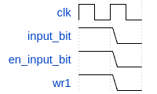
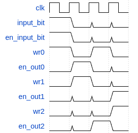

# Secuenciales
**Analizar el componente regZ y responder**:

**1. ¿Cuáles son y qué representa cada entrada y cada salida del componente? ¿Cuáles entradas deben ser consideradas como de control?**

**Entradas**:

- **clk:**  Es un clock de un bit. Su valor es una señal intermitente. (Dependiendo del valor que se nos envie como clock, se envia o no una señal al flip flop. )
- **Reg_in:** Es el bit que queremos guardar en el flip-flop.
-  **w:**  Es la entrada de control que permite habilitar la escritura en el flip-flop.
- **en_out:** Es el bit que habilita la salida del dato del flip-flop al bus

**Salidas**:

- **Reg_debug:**  Permite visualizar el valor del bit almacenado en el registro.
- **Reg_output:**  Dependiendo del valor del en_out envia al bus el dato almacenado. 

**2. Las entradas input_bit y en_input_bit sirven para poder introducir en el circuito un valor arbitrario. Escribir una secuencia de activación y desactivación de entradas para que el registro R1 pase a tener el valor 1.**

**3. Dar una secuencia de activaciones que inicialmente ponga un valor 1 en R0, luego que este valor se transfiera a R1, luego que el valor de R2 pase a R0 y finalmente el valor de R1 a R2.**

## OrgaSmall

**Recorrer la máquina y la hoja de datos, estudiar el funcionamiento de los circuitos indicados y responder las siguientes preguntas:**

**1. ¿Cuál es el tamaño de la memoria?**

- El tamaño de la memoria es de 2048 bits, separados en 256 palabras de 8 bits.

**2. ¿Qué tamaño tiene el PC?**

-  El tamaño del PC es de 8 bits

**3. Observando el formato de instrucción y los CodOp de la hoja de datos: ¿Cuántas instrucciones nuevas se podrían agregar respetando el formato de instrucción indicado?**

- Respetando el formato de instruccion indicado, se podrian agregar 11 instrucciones mas al OrgaSmall.
Esto porque el CodOp(codigo de operacion) es de 5 bits. Las instrucciones maximas que se pueden definir con 5 bits son 32 pues 2⁵=32, y las instrucciones definidas son solo 21. 

**Mirando los módulos indicados de hardware:**

**1. PC (Contador de Programa): ¿Qué función cumple la señal inc?**
    
- La señal inc, le señala al contador que cuando llega un clock tiene que incrementar el valor del registro en 1

**2. ALU (Unidad Aritmético Lógica): ¿Qué función cumple la señal opW?**
        
- La señal opW(Write OP) es una entrada de control que habilita la escritura de las flags 

**3. microOrgaSmall (DataPath): ¿Para qué sirve la señal DE_enOutImm? ¿Qué parte del circuito indica que registroc se va a leer y escribir?**
    
- La señal DE_enOutImm (Decode Enable Out Immediate) habilita la escritura en el bus de datos del valor M.

- Las partes del circuito que indican que registro se va a leer y escribir son:
    
    - **Control Unit (unidad de control)**: elige si se usa el registro X o Y 
    
    - **Decode**: Envia los valores X e Y

**4. ControlUnit (Unidad de control): ¿Cómo se resuelven los saltos condicionales? Describir el mecanismo.**
    
- Por cada flag existe un jump distinto. Dependiendo del valor de cada flag, se ejecutara o no su respectivo jump. 

- Hay 3 tipos de jumps:  
    - **JC**: Se ejecuta si la flag del Carry(flag_C) vale 1.

    - **JZ**: Se ejecuta si la flag del Zero(flag_Z) vale 1.

    - **JN**: Se ejecuta si la flag del Negative(flag_N) vale 1.

- Para ejecutar un salto, el decode envia un valor (M) al ControlUnit y este le asigna ese valor al PC. Entonces en el proximo clock la ejecucion se reanuda desde la instruccion que fue asignada a PC.

## Ensamblar y correr
**1. Antes de correr el programa, identificar el comportamiento esperado.
¿Qué lugar ocupará cada instrucción en la memoria? Detallar por qué valor se reemplazarán las etiquetas.**
- **JMP seguir**: Ocupara el espacio 0x00 y 0x01. Esta instrucción se traduce como: 1010 0000 0000 0010 (a0 y 02)
- **SET R0, 0xFF**: Ocupara el espacio 0x02 y 0x03. Esta instrucción se traduce como: 1111 1000 1111 1111 (f8 y ff)
- **SET R1, 0x11**: Ocupara el espacio 0x04 y 0x05. Esta instrucción se traduce como: 1111 1001 0001 0001 (f9 y 11)
- **ADD R0, R1**: Ocupara el espacio 0x06 y 0x07. Esta instrucción se traduce como: 0000 1000 0010 0000 (08 y 20)
- **JC siguiente**: Ocupara el espacio 0x08 y 0x09. Esta instrucción se traduce como: 1010 1000 0000 0110 (a8 y 06)
- **JMP halt**: Detiene la ejecucion

**2. Ejecutar y controlar ¿cuántos ciclos de clock son necesarios para que este código llegue a la instrucción JMP halt?**

- Son necesarios 54 ciclos de clock para que llegue al JMP halt

**3. ¿Cuántas microinstrucciones son necesarias para realizar el ADD? ¿Cuántas para el salto?**

- Para realizar el ADD seran necesarias 5 microinstrucciones. Para realizar un JMP, se necesitan 2 microinstrucciones.

## Extras
Realizamos los siguientes puntos:
- Sin agregar circuitos nuevos, agregar la instrucción NEG que obtenga el inverso aditivo de un número sin modificar los flags. Nota: el inverso aditivo de un número se puede obtener como xor(XX, 0xFF) + 0x01. Utilizar como código de operación el 0x0A.
- Modificar las instrucciones JC, JZ, JN y JMP para que tomen como parámetro un registro.
> [!NOTE]  
> Para hacer este ejercicio tuvimos que modificar el archivo *assembler.py* ya que cambiaba el tipo de instruccion de JMP. El archivo modificado se llama *assemblerOpcionales.py*
- Modificar el circuito agregando las conexiones necesarias para codificar las instrucciones STR [RX+cte5], Ry y LOAD Ry, [RX+cte5]. Este par de instrucciones son modificaciones a las existentes, considerando que cte5 es una constante de 5 bits en complemento a dos.